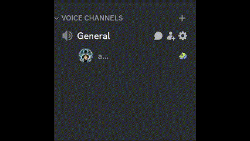

# Rhythm Rover

Rhythm Rover is a Discord bot that plays audio files when users join or leave a voice channel. Users can register an intro or outro using `/intro` or `/outro` commands. They can also completely wipe any saved audio by using the `/delete` command.

Intro Example            |  Outro Example
:-------------------------:|:-------------------------:
  |  

## Features

- Plays audio files for user interactions in voice channels.
- Register custom intro and outro audio clips.
- Delete saved audio clips associated with a user.
- Wide range of websites are supported for registering an audio clip

## Usage

1. **Setup:**
   - Clone the repository.
   - Install Python 3.12 and ffmpeg.
   - Install [uv](https://docs.astral.sh/uv/).
   - Install the required dependencies with `uv sync`.
   - Copy `.env.example` to `.env`.
   - Set `TOKEN` to your Discord bot token.
   - Set `OWNER` to your Discord user ID if you use the owner-only `!sync` command.
   - Optionally set `PRSSERVER`, `FRSERVER`, `AUDIO_DIR`, and `OUTRO_TRIGGER_SECONDS`.
   - Enable only the required [intents](https://github.com/jadistanbelly/Rhythm-Rover?tab=readme-ov-file#oauth2) in the Developer Portal.

2. **Running the Bot:**
   - Start the bot using `uv run bot.py`.

3. **Commands:**
   - `/intro`: Register an intro audio clip.
        - video_url = paste the link you would like to download
        - start = give the start time for the clip.
            - This can be in any format (SS) or (HH:MM:SS)
        - end = give the end time for the clip.
            - This can be in any format (SS) or (HH:MM:SS)
   - `/outro`: Register an outro audio clip.
        - video_url = paste the link you would like to download
        - start = give the start time for the clip.
            - This can be in any format (SS) or (HH:MM:SS)
        - end = give the end time for the clip.
            - This can be in any format (SS) or (HH:MM:SS)
   - `/delete`: Delete all saved audio clips for the user.
   - `/kill`: Clear bots audio queue to prevent spamming (owner only).
   - `!sync`: sync changes to tree commands (owner only).

## OAuth2

| Permissions                 | Privileged Gateway Intents           | Scopes                 |
|-----------------------------|--------------------------------------|------------------------|
| Read Messages/View Channels | Server Members Intent                | applications.commands  |
| Use Application Commands    | Message Content Intent for `!sync`   | bot                    |
| Send Messages               |                                      |                        |
| Connect                     |                                      |                        |
| Speak                       |                                      |                        |
| Use Voice Activity          |                                      |                        |

**Note:**

Presence Intent is not required. Message Content Intent is only needed while the prefix-based `!sync` command exists.

Use the Discord Developer Portal URL generator with the listed scopes and permissions. Avoid reusing older invite links that include broad permissions from testing.

Example format:

`https://discord.com/oauth2/authorize?client_id=INPUT_YOUR_CLIENT_ID_HERE&permissions=36703232&scope=applications.commands+bot`

## Development

```bash
uv sync --all-groups
uv run --locked ruff check .
uv run --locked pytest
uv run --locked pip-audit -r <(uv export --locked --format requirements-txt --no-dev --no-hashes)
```

## Contributing

Feel free to contribute to the project by submitting pull requests.

## License

This project is licensed under the MIT License - see the [LICENSE](https://github.com/jadistanbelly/Rhythm-Rover?tab=MIT-1-ov-file) file for details.

## Support

For any issues or questions, please reach out via [Email](mailto:jadistanbelly@outlook.com) or [Github](https://github.com/jadistanbelly/Rhythm-Rover/issues).
